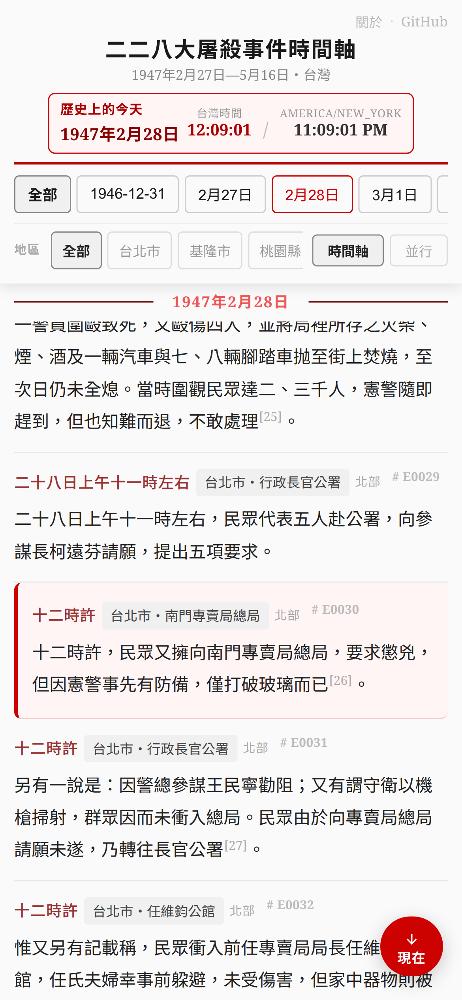
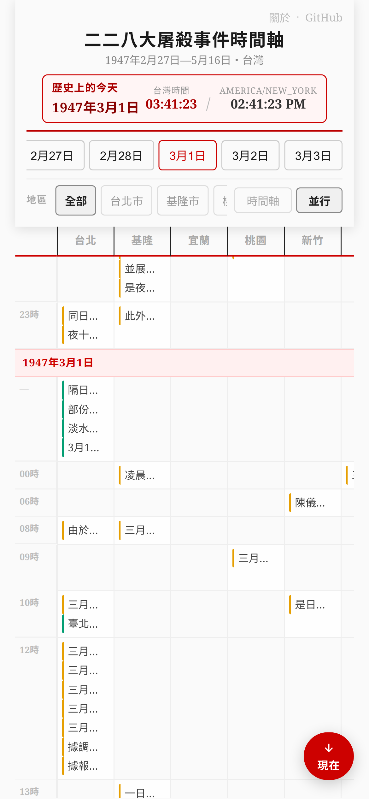

# 二二八大屠殺事件時間軸・228 Massacre Timeline

1947年2月27日至5月16日，二二八事件時間軸。依日期、地區逐條呈現史料記載，整合行政院1992年研究報告與二二八事件紀念基金會2005年責任歸屬報告。

**→ [mlouielu.github.io/228-massacre-timeline](https://mlouielu.github.io/228-massacre-timeline/)**

| 時間軸 | 並行 |
|--------|------|
|  |  |

## 資料來源

**行政院1992報告版**

「二二八事件」研究報告

* 著者：行政院研究二二八事件小組（召集人：陳重光、葉明勳；總主筆：賴澤涵）
* 出版：財團法人二二八事件紀念基金會，2025年2月（原著作成於1992年）
* ISBN：978-626-995-170-3

**基金會2005報告版**

二二八事件責任歸屬研究報告

* 著者：財團法人二二八事件紀念基金會
* 出版：財團法人二二八事件紀念基金會，2006年2月

依著作權法第65條（合理使用）原則引用原著作片段，用於非商業、教育性質之歷史研究。
